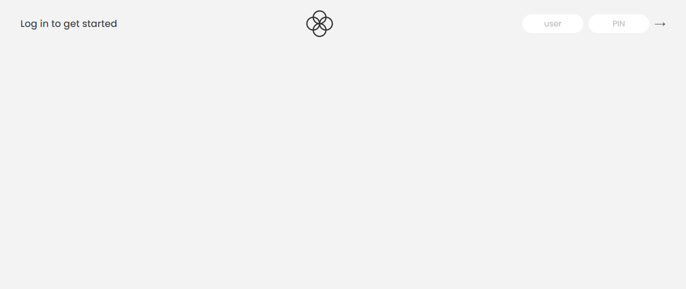
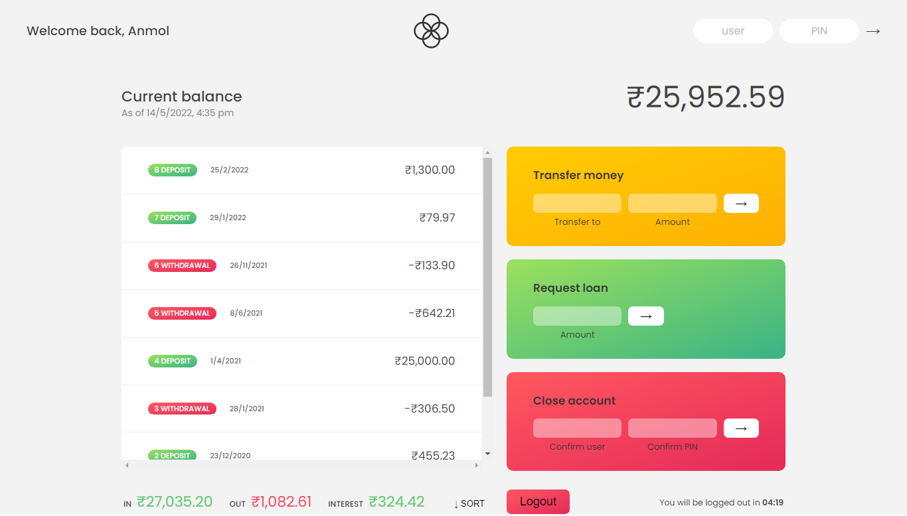

# BankMan - Banking Specialist

- A Banking Web Application which helps user to make international and domestic transfers.
  
  
  
This Applictaion supports various features such as -
 
 
 
- Real Time Money Conversion
-  
- Timed Login
 
- Loader
 
- Deleting a account
 
- Login and Logout
 
- Transfering Money
 
- Loan Applying
  
  
  
This project was completed in the span of a week.
 
 
 

**Tech Stack Used**

 

- HTML5

 

- CSS3

 

- Javascript
 
 
 

This Application is available at (BankMan)[https://bankman.netlify.app]

 
 
 <h3>There are 7 accounts already made</h3>
 
Username - br & Password - 1111

 
Username - nm & Password - 2222

 
Username - vc & Password - 3333

 
Username - ukc & Password - 4444

 
Username - js & Password - 5555

 
Username - mj & Password - 6666

 
Username - rj & Password - 7777

  
  
 <ul>
 <li>User can login with given userid and password.</li>
  <li>User can send money to any of the above user.</li>
   <li>User can delete account by entering username and password in close account.</li>
    <li>User can apply for loan and loan will be provided if certain criteria is met.</li>
     <li>User can logout from the account.</li>
      <li>User will automatically loggedout if time runs out i.e 10 minutes</li>
 </ul>
      
**Login**

**LoggedIn**

